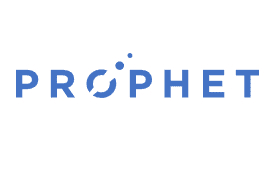
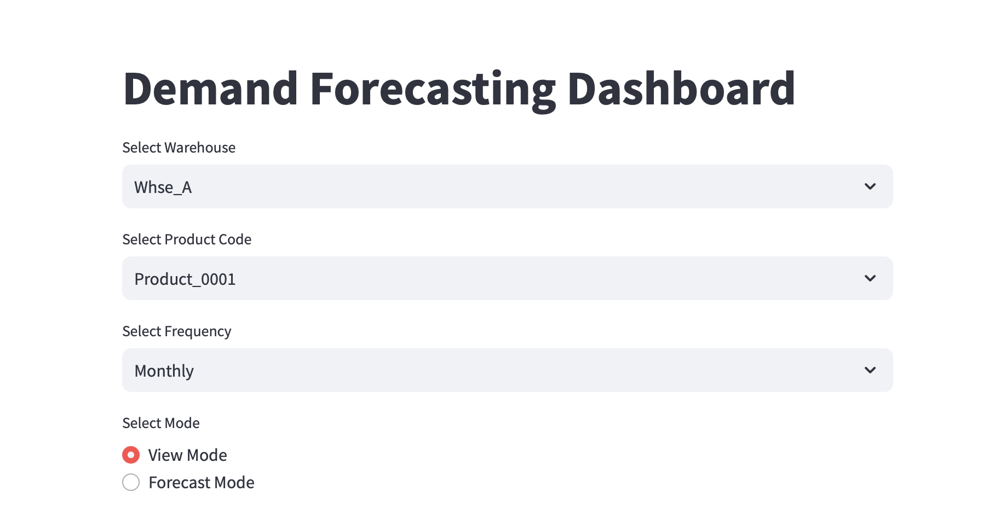
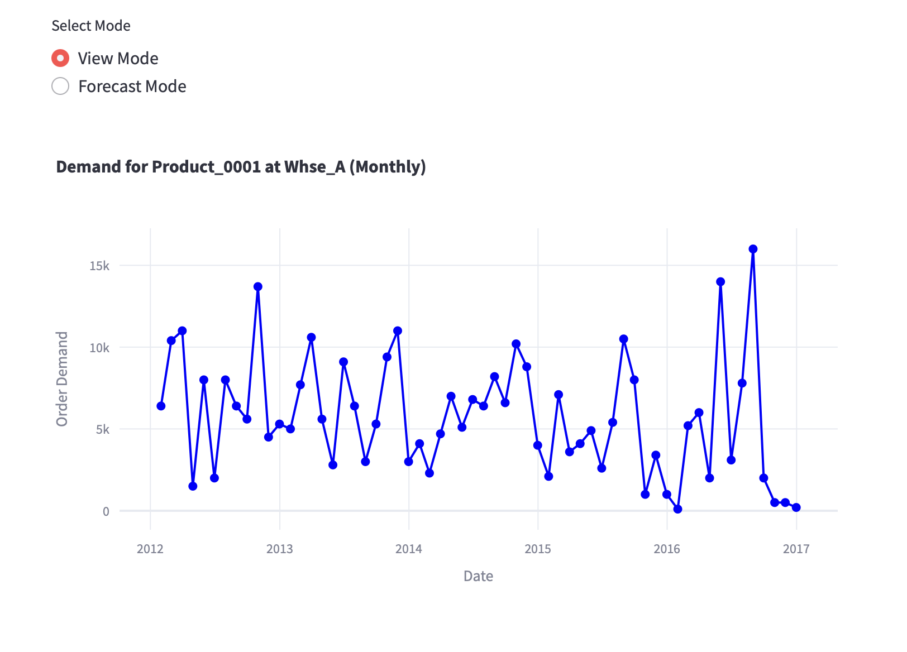
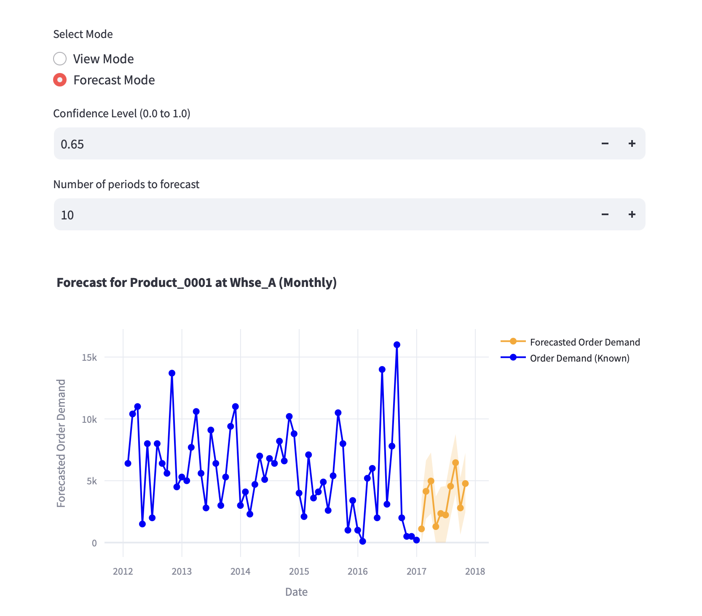

# Demand Forecast App
A demand forecasting app offering data views, confidence-based forecasts, and customizable prediction horizons for optimized inventory management.

## About
This project is a demand forecasting tool designed for inventory management using Facebook Prophet library for time series forecasting. With data from four warehouses, it provides customizable predictions for specific products at each location, with adjustable confidence levels and prediction horizons. Built and deployed on Streamlit Community Cloud, the app offers a user-friendly interface to visualize trends, forecast demand, and optimize inventory levels.

## Built With

<table>
  <tr>
    <td align="center">
      <a href="https://www.python.org">
        
      </a>
      <br>Python
    </td>
    <td align="center">
      <a href="https://facebook.github.io/prophet/">
        
      </a>
      <br>Facebook Prophet
    </td>
    <td align="center">
      <a href="https://streamlit.io/">
        
      </a>
      <br>Streamlit
    </td>
  </tr>
</table>


## Features
- **Customizable Confidence Levels and Forecast Horizon**: Users can set confidence intervals to tailor forecast certainty and adjust the forecast horizon, allowing for granular control over prediction accuracy.
- **Interactive Web Application**: Built with Streamlit for user-friendly interaction and deployed on a community cloud.
- **Time Series Forecasting Techniques**: Utilizes various advanced methods, including the Prophet model with holiday adjustments, Autoregressive and Moving Average models for trend and seasonality capture, and Fourier series components for handling seasonality in high-frequency data.


## Installation & Usage
1. Clone the repo:
   ```bash
   git clone https://github.com/rohitbarve9/demand-forecast-app.git
2. Install dependencies
    ```bash
    pip install -r requirements.txt
3. Run the `streamlit run main.py` command in terminal to start the web application.


## Demo 

Project Link: https://demand-forecast-appn.streamlit.app/

<div style="display: flex; flex-direction: column; align-items: center; gap: 20px;">

  <div style="border-bottom: 2px solid #ddd; padding-bottom: 10px; margin-bottom: 20px; width: 450px; text-align: center;">
    
    <br>Demo 1
  </div>

  <div style="border-bottom: 2px solid #ddd; padding-bottom: 10px; margin-bottom: 20px; width: 450px; text-align: center;">
    
    <br>Demo 2: View Mode
  </div>

  <div style="padding-bottom: 10px; width: 450px; text-align: center;">
    
    <br>Demo 3: Forecast Mode
  </div>

</div>


